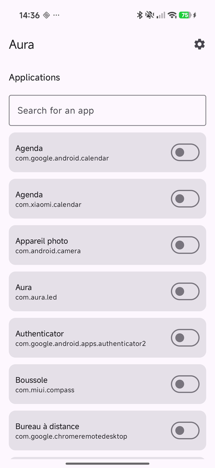
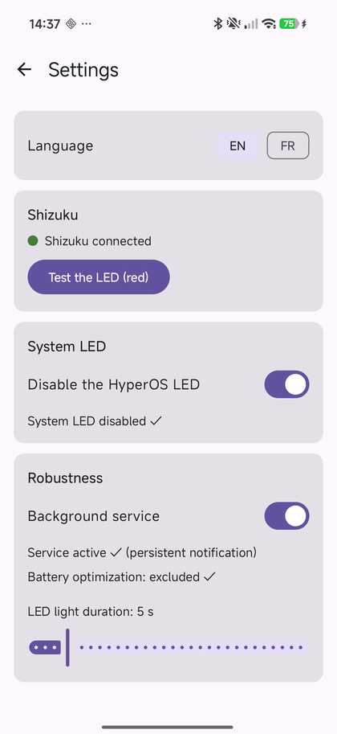

# Aura — Custom LED and notification light for POCO X8 Pro (HyperOS)

[](https://github.com/tgvdufuture/Aura/actions/workflows/build.yml)

Aura is an open-source Android app for **custom LEDs on the POCO X8 Pro**. It drives the **RGB LED rings** on the back of the phone (Xiaomi / **HyperOS 3**) and shows a different **color** and **animation** per **app**, per **contact** and per **group** — **while the screen is off**. It replaces HyperOS's default notification light, which is limited to a single global color with no sender distinction.

If you are looking for a **custom notification LED**, **RGB notification ring**, **back LED effect** or a way to customize the **rear lights on a POCO X8 Pro**, Aura provides per-app and per-sender rules without root. The **POCO X8 Pro Max** (also known as **Redmi Turbo 5 Max**) is supported by the same LED hardware and has been confirmed working by users.

En français : Aura permet de personnaliser la **LED arrière**, la **lumière de notification** et les **anneaux RGB** du POCO X8 Pro sous HyperOS, avec une couleur différente pour chaque application, contact ou groupe.

> Notification LED · RGB LED · light ring · POCO X8 Pro · Xiaomi · HyperOS · Shizuku · Android · custom notification LED · RGB notification ring — **no root required**.

- 100% local: no network permission, no backend, no telemetry.
- Hardware control via **Shizuku** (ADB privileges) or, for rooted devices, directly through `su`.
- Resolution priority: **contact > group > app**.

## Features

- **Color per app**: each enabled app has a default LED color.
- **Live LED preview**: tap a color in the picker to preview it on the ring in real time before saving.
- **Color + animation per contact/group**: messages (WhatsApp…) and calls can be distinguished by sender (breathing, flashing, rainbow, alert).
- **Lock screen aware**: the LED drives when the screen is off **or** the device is locked; it stays off only while you're actively using the phone.
- **"Last one wins" with smart fallback**: a new notification replaces the previous state, and dismissing it falls back to the previous one.
- **Auto-restart on boot**: the service and notification listener reconnect automatically after a reboot.
- **Light / dark / auto theme**: manual toggle in Settings (follows the system by default).
- **System LED disabled** on HyperOS to avoid double lighting (single driver).
- **Configurable light duration** (1–30 s, default 10 s).
- **English / French UI**: language picker on first launch (choice persisted, switchable from Settings).
- Works even when **notification content is hidden on the lock screen** (content recovered via Shizuku — see *How it works*).

## Screenshots

| Main screen | Settings |
|-------------|----------|
|  |  |

## Download

Get the latest signed APK from the [releases page](https://github.com/tgvdufuture/Aura/releases/latest):

- **[v0.4.2](https://github.com/tgvdufuture/Aura/releases/tag/v0.4.2)** — `app-release.apk`

## Prerequisites

### Hardware / system
- **POCO X8 Pro** running **HyperOS 3** (Android 16). This is the only device it has been developed and tested on. The **POCO X8 Pro Max** (a.k.a. Redmi Turbo 5 Max) shares the same RGB ring hardware and HyperOS version, and has been **confirmed working** by users.
- **Shizuku** installed and enabled (see below), unless the device has working root access. Root fallback is experimental.

### Build environment
- JDK **17**
- **Android SDK** (compileSdk 36, minSdk 26)
- Gradle **8.13+** (the wrapper is provided, nothing to install)

## Build

```bash
# Linux / macOS
./gradlew assembleDebug

# Windows
gradlew.bat assembleDebug
```

The APK is generated at:

```
app/build/outputs/apk/debug/app-debug.apk
```

### Installing on the device

```bash
adb install -r app/build/outputs/apk/debug/app-debug.apk
```

## Getting started

Aura needs a few one-time permissions to take control of the ring. Do these in order.

> **Enable the notification LED on the phone first:** turn on the back light in **Settings → Additional settings → Back light effects** (French: *Paramètres supplémentaires → Effets de lumière arrière*). Without it the ring won't light up, even though Aura is running.

### 1. Install Aura

1. Download the latest `app-release.apk` from the [releases page](https://github.com/tgvdufuture/Aura/releases/latest).
2. Open the APK and allow the install when your browser / file manager asks ("Install unknown apps").

### 2. Set up Shizuku or root

Aura drives the LED through **Shizuku** or a root shell. Root users do not need Shizuku; Aura detects root automatically and shows it in Settings.

> **Root support status — not tested:** the root fallback (`su`) is implemented but has not yet been tested on a physically rooted phone. The development phone used for this release has no `su`, so Shizuku is the only validated privilege path. If you test root, grant Aura permanent access in Magisk/KernelSU/APatch and use **Test the LED** first.

**Root:** grant Aura permanent root access in Magisk/KernelSU/APatch, then continue with step 3.

**Shizuku:**

1. Install **Shizuku** from the [Play Store](https://play.google.com/store/apps/details?id=moe.shizuku.privileged.api) or [shizuku.rikka.app](https://shizuku.rikka.app/).
2. Start it, one of two ways:
   - **Wireless (recommended, no PC):** enable **Developer options** (Settings → About phone → tap the **HyperOS version** 7 times), then turn on **Wireless debugging**. In Shizuku, tap **Start → Wireless debugging** and follow the pairing prompts.
   - **Via a PC (ADB):** connect the phone to a computer that has `adb`, then run the command Shizuku shows under **"Start via computer connection" → "Show command"**.
3. Wait until Shizuku shows **"Shizuku is running"**.

### 3. Grant Aura's permissions

Open **Aura**, pick your language, then open **Settings**:

1. **Notification access** — in **Settings → Robustness**, the **notification listener** row shows its status; tap it to open the system screen and enable Aura.
2. **Privilege access** — with Shizuku, tap **"Request authorization"**; with root, grant Aura access in your root manager. Then tap **"Test the LED (red)"** to confirm the ring lights up.

### 4. Let it survive HyperOS (important)

HyperOS aggressively kills background apps, so do both of these in **Settings → Robustness**:

1. Tap **"Open Autostart settings"** and **enable Aura** in the MIUI autostart manager.
2. Tap **"Exclude from battery optimization"** and choose **"No restrictions"**.

> Without autostart, HyperOS may block the notification listener after a reboot.

### 5. Choose your colors

1. On the main screen, toggle the apps you want and pick a **default color** (tap a swatch, or the **+** for a custom color — the ring shows a live preview).
2. For messages and calls, turn on **"Identify sender"** and add **contact** / **group** rules with their own color and animation.

### 6. (Optional) Avoid double lighting

HyperOS lights the ring itself too. In **Settings**, disable **"System LED"** so only Aura drives the ring.

## How it works

- **`notification/AuraNotificationListener`**: detects notifications (`NotificationListenerService`) and only emits a LED command while the device is not actively used (screen off or locked).
- **`engine/RuleEngine`**: resolves the rule according to the contact → group → app priority.
- **`led/ShizukuLEDController`**: drives the rings via the `miui.lights.ILightsManager` system service (`setCustomLight`), using Shizuku when authorized or `su` on rooted devices. The color is arbitrary (RGB) and the LED turns off automatically after the timeout.
- **`notification/FullNotificationReader`**: when Android hides notification content on the lock screen, the listener only receives a redacted version (empty title/text). Aura then recovers the full content via `dumpsys notification --noredact` (run through Shizuku or root) so contact/group rules — and their animations — keep working while the screen is off.
- **`data/`**: local persistence of rules and settings with **Room**.
- **`ui/`**: **Jetpack Compose** UI.

## Frequently asked questions

### Can I customize the LEDs on a POCO X8 Pro?

Yes. Aura customizes the back RGB LED rings of the POCO X8 Pro and can assign a color and animation to each app, contact or group notification.

### Does Aura need root?

No. The validated setup uses Shizuku with ADB-level privileges. An experimental root fallback is also included.

### Does it work on the POCO X8 Pro Max or Redmi Turbo 5 Max?

The POCO X8 Pro Max, also called Redmi Turbo 5 Max, shares the same RGB ring hardware and has been confirmed working by users. Other POCO models are not guaranteed.

### Which HyperOS notification light settings should I use?

Enable the phone's back light effects first, then disable HyperOS's System LED in Aura so that only Aura controls the notification ring and double lighting is avoided.

### Recherches en français

Les termes **LED personnalisée POCO X8 Pro**, **lumière arrière POCO**, **anneau LED de notification HyperOS** et **couleur LED par application POCO** décrivent le même usage pris en charge par Aura.

## Tech stack

- Kotlin 2.1, Jetpack Compose (Material 3)
- Room (local persistence)
- Kotlin Coroutines / Flow
- [Shizuku](https://github.com/RikkaApps/Shizuku) (API 13.1.5)

## License

[MIT](LICENSE) — © 2026 Aura Contributors
